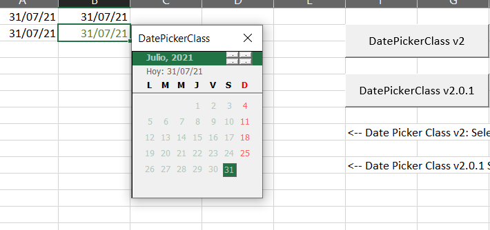
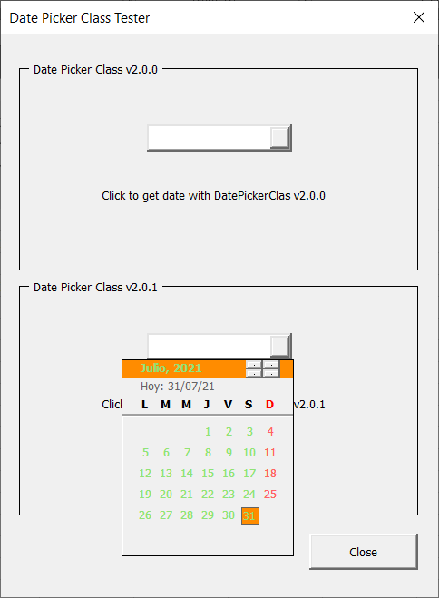
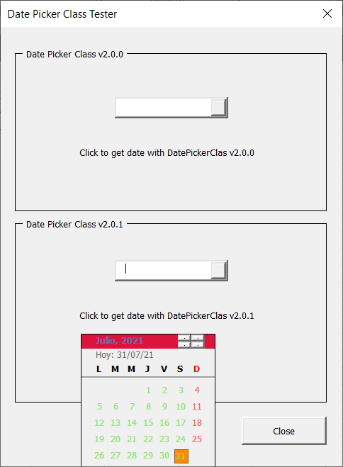

# DatePickerClass

> Excel's simple date picker for use with macros.

## Definition
DatePickerClass is a VBA Class file (.cls) with wich is easy to generate a simple Date Picker for use with macros on Excel Sheets and VBA Forms.

> It is necessary to have basic knowdlements about VBA Class programation.

It works under MS Excel version 2007+. No installation required, just import to your VBA Project.

As DatePickerClass is a VBA Class, it needs to be instanciated as an Object and then use its methods and properties interface.

> **IMPORTANT!:** DatePickerClass dynamically creates a Control Frame so it necessarily requires an Object of type UserForm in which it can be added. The Control Frame is called "DatepickerFrame1" and in turn incorporates several Controls of type Label, SpinButton and Frame: "DatepickerLblHead2", "DatepickerSpinHead1", "DatepickerSpinHead2", "DatepickerLblBody1 to 42" and "DatepickerFrame2".
Avoid inserting a Control to your form with any of the mentioned names, errors or unexpected behaviors would occur.

## Acknowledgments
This project was inspired by the work developed by [Microsoft MVP, Andrés Rojas Moncada](www.youtube.com/jarmoncada01) ([web page](https://www.excelhechofacil.com/)) Calendar in with UserForm for Version 1.0 of July 20, 2015 and uses the core of its algorithm. Thank you very much Andrés for all your talent.

## Use Mode
  1.  [Download DatePickerClass.cls](./project-dev/DatePickerClass.cls) file.
  2.  Create a new Excel enabled for macros workbook.
  3.  Open the VBA Editor with Ctrl+F11
  4.  Go to ***File > Import File*** menu or press ***Ctrl+M*** and then search your DatePickerClass.cls downloaded file and import it to the VBA Project.
  5.  You can create a new Module and a new Form where ***DatePickerClass*** will be used (also you can download the [datepickerexampleuse.xlsm](./project-dist/datepickerexampleuse.xlsm) file to see a practical and easy ways of use ***DatePickerClass***)

### Version 2.0.1

  6.  Core algorithms improved. Still has one method:

      1. **DatePicker** needs a required parameter: the UserForm holder; the rest of parameters are optionals, no values returned:
      ```vb
        Public Sub DatePicker( _
          ByVal FRM As MSForms.UserForm, _
          Optional DJustForm As DPC_JustForm = dpcAsObject, _
          Optional DFirstDay As VbDayOfWeek = VBA.vbMonday, _
          Optional DControl As Object, _
          Optional DAlign As DPC_Alignment = dpcLeft, _
          Optional DBaseColor As XlRgbColor = 4616993, _
          Optional DMsgBox As Boolean = False)

          ...

        End Sub
      ```
      Donde:
      - **FRM:** Required. A UserForm;
      - **DJustForm:** Optional. VBA Enumeration with two possible values: *dpcAsObject y dpcAsForm*, first to work with *DatePickerClas* as object inside a UserForm, second value to show a UserForm in Excel's spreadsheet to put a date in a cell. Default value: ```dpcAsObject```, as object.
      - **DFirstDay:** Optional. VBA constant, by default: ```VBA.vbMonday```.
      - **DControl:** Optional. A MSFORMS.control or a Excel Range where will be inserted the selected date.
      - **DAlign:** Optional. VBA Enumeration with three possible values: *dpcLeft, dpcRight, dpcCenter*, aligns DatePickerClass respect to control ```DControl```. By default: *dpcLeft*.
      - **DBaseColor:** Optional. Constant *XlRgbColor*. To *DatePickerClass* color theme. Also can generate a color using the VBA method: ```VBA.RGB(RR, GG, BB)``` or any number that corresponds with the desired color. By default: ```4616993 ó VBA.RGB(33, 115, 70)```, Native Excel's green color.
      - **DMsgBox:** Optional. a Boolean, by default: ```False```, to show a ```VBA.msgbox``` with the selecte date by user.

      After *DatePicker* method is called, UserForm will show next:

      In Excel's spreadsheet:
      ```vb
        Dim dp201 As DatePickerClass_v201
        
        'DatePickerClass DPC_v2.0.1_click to range cell.
        Set dp201 = New DatePickerClass_v201
        Call dp201.DatePicker(UserForm1, dpcAsForm, DControl:=Target)
        
        Set dp201 = Nothing
      ```

      

      In a TextBox control of UserForm:
      ```vb
      Private Sub TextBox2_DropButtonClick()
        
        ' dp201 is a instance of DPC created at initialize form event
        Call dp201.DatePicker(Me, DControl:=Me.TextBox2, DAlign:=dpcRight, DBaseColor:=rgbDarkOrange)
        
      End Sub
      ```

      

      In a Label control of UserForm:
      ```vb
      Private Sub Label2_Click()
        
        ' dp201 is a instance of DPC created at initialize form event
        Call dp201.DatePicker(Me, DControl:=Me.Label2, DBaseColor:=rgbCrimson)
        
      End Sub
      ```

      

---

### Versión 2.0.0

  6.  Optimized the class, now just has a method: similar use mode than first version but do not has the property ```GetDate``` anymore!

      ```vb
        DatePicker( _
          ByVal Frm As Object, _
          Optional dJustForm As Boolean = False, _
          Optional dFirstDay As Long = VBA.vbMonday, _
          Optional dControl As Object, _
          Optional dAlign As String = "Left", _
          Optional dBaseColor As Long = 4616993, _
          Optional dMsgBox As Boolean = False) As Date
      ```
---

### Version 1.0.0

  6.  The Class has a Property and a Method:

      1. The ```GetDATE``` property returns the selected date with the **DatePickerClas** object. Its default value is the current system date.

      2. With the ```DatePicker``` Method you can add the Date Picker Control in a UserForm previously created in your VBA Project. This method requires a mandatory parameter: The UserForm Object and some optional parameters and since it is a function, it will always return a Date type value:
      ```vb
        DatePicker( _
          ByVal Frm As Object, _
          Optional dJustForm As Boolean = False, _
          Optional dFirstDay As Long = VBA.vbMonday, _
          Optional dControl As Object, _
          Optional dAlign As String = "Left", _
          Optional dBaseColor As Long = 4616993, _
          Optional dMsgBox As Boolean = False) As Date
      ```
      Where:

        - ***Frm:*** Required. As already mentioned, the first parameter is a UserForm Object;
        - ***dJustForm:*** Optional. The second is a Boolean with which it indicates to DatePickerClass if the control will be used within the form to assign a date to some control type TextBox, Label (recommended) or ComboBox, in False; or if you want to use the control in an Excel sheet to assign the date in a cell, True. Default value: False.
        - ***dFirstDay:*** Optional. This is a constant of day type VBA, VBA.vbMonday or VBA.vbSunday or the first day of the week in your calendar, its default value is VBA.vbMonday.
        - ***dControl:*** Optional. Data type Object Control or Range. If you apply DatePickerClass on a form to assign the returned value for example to a TextBox1 control, in dControl you must send the TextBox1 control; If the environment where you want to apply is an Excel sheet, in dControl you can send the cell (s) as a Range object. Default value: Nothing.
        - ***dAlign:*** Optional. Requires a String data type: "Right" (from "Right"), "Left" (from "Left") or "Center" (from "Center") to tell the DatePickerClass object to align with respect to the control sent in the dControl parameter. The default value is "Left".
        - ***dBaseColor:*** Optional. Long data type. It is used to set the style color of DatePickerClass, it can be the result of the native VBA.RGB (RR, GG, BB) function of VBA or a number that corresponds to the value of the color you want. Default value: 4616993 or VBA.RGB (33, 115, 70), green color of the native Excel theme.
        - ***dMsgBox:*** Optional. It is a Boolean value, default: False, this parameter tells DatePickerClass, shows a VBA.msgbox with the date selected by the user.

  7. Enjoy **DatePickerClass**!


## Collaboration on GitHub:
**DatePickerClass** source code is in: [project-dev folder](https://github.com/Roccouu/DatePickerClass/tree/master/project-dev/DatePickerClass.cls) into this Official repository.
As soon it is downloaded, you can collaborate with improvements to the System always under respect of [License terms](https://github.com/Roccouu/DatePickerClass/blob/master/LICENSE), [Code of conduct](https://github.com/Roccouu/DatePickerClass/blob/master/CODE_OF_CONDUCT.md) and the [Contribution terms](https://github.com/Roccouu/DatePickerClass/blob/master/CONTRIBUTING.md).

## Website

[DatePickerClass](https://roccouu.github.io/DatePickerClass/docs/index.html)

## Tutorial

[DatePickerClass tutorial](https://roccouu.github.io/DatePickerClass/docs/index.html#/tutorial)

## Documentation

[DatePickerClass Docs](https://roccouu.github.io/DatePickerClass/index.html#/docs/index.html#/documentation)

## Contributing

See the [CONTRIBUTING Guidelines](https://github.com/roccouu/DatePickerClass/CONTRIBUTING.md)

## License

[MIT](https://github.com/roccouu/DatePickerClass/blob/master/LICENSE) © | [Roccou](https://www.linkedin.com/in/roberto-carlos-romay-medina/) | [E-Mail](rocky.romay@gmail.com) | 2021