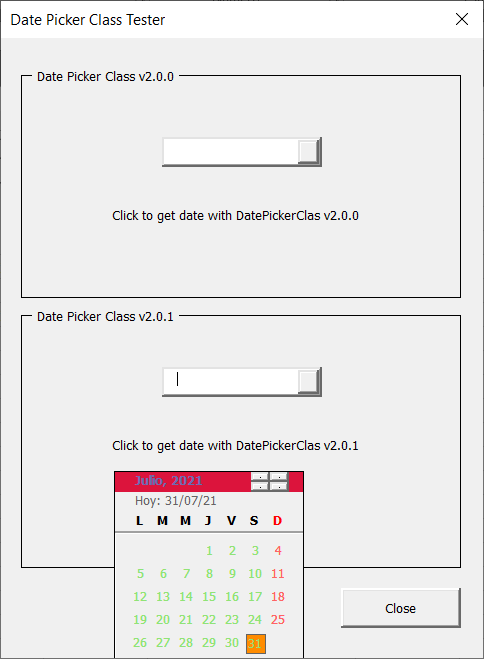

# DatePickerClass

> Un sencillo selector de fechas para Excel para ser usado con macros.

## Definición
DatePickerClass es un archivo de Clase VBA (.cls) con el que es fácil generar un Selector de Fechas mediante el uso de macros para hojas y formularios de Excel.

> Es necesario tener conocimientos básicos de programación de Clases VBA (POO, Programación Orientada a Objetos).

Trabaja bajo MS Excel versión 2007 o superior. No requiere instalación, sólo debe ser importardo a su Proyecto VBA.

Como DatePickerClass es una Clase VBA, debe instanciarse como un objeto y luego usar su interfaz de métodos y propiedades.

> **¡IMPORTANTE!:** DatePickerClass crea dinámicamente un Control Frame por lo que requiere necesariamente un Objeto de tipo UserForm en el que se pueda añadir. El Control Frame tiene por nombre "DatepickerFrame1" y a su vez incorpora varios Controles de tipo Label, SpinButton y Frame: "DatepickerLblHead2", "DatepickerSpinHead1", "DatepickerSpinHead2", "DatepickerLblBody1 a 42" y "DatepickerFrame2".  
Evite insertar un Control a su formulario con alguno de los nombres mencionados, se producirían errores o comportamientos inesperados.

## Reconocimientos
Este proyecto fue inspirado en el trabajo desarrollado por [Andrés Rojas Moncada, Microsoft MVP](www.youtube.com/jarmoncada01) ([Sitio web](https://www.excelhechofacil.com/)): Calendario con UserForm para su Versión 1.0 de 20 de julio de 2015 y usa el núcleo de su algoritmo. Muchas gracias Andrés por todo tu talento.

## Modo de uso
  1.  [Descargue el archivo DatePickerClass.cls](./project-dev/DatePickerClass.cls).
  2.  Cree un nuevo libro habilitado para macros de Excel.
  3.  Abra el Editor de Proyectos VBA con Ctrl+F11
  4.  Vaya al menú ***Archivo > Importar Archivo*** o presione ***Ctrl+M*** y luego busque su archivo DatePickerClass.cls descargado e impórtelo al Proyecto VBA.
  5.  Puede crear un nuevo módulo y un nuevo formulario donde se utilizará ***DatePickerClass*** (también puede descargar [datepickerexampleuse.xlsm](./project-dist/datepickerexampleuse.xlsm) para ver algunos ejemplos prácticos y fáciles de usar ***DatePickerClass***)

### Versión 2.0.1

  6.  Optimizados los algoritmos del núcleo de la Clase. Continúa con un solo Método:

      1. **DatePicker** requiere un parámetro obligatorio: El Objeto UserForm que es donde residirá; los demás parámetros son opcionales, no retorna ningún valor:
      ```vb
        Public Sub DatePicker( _
          ByVal FRM As MSForms.UserForm, _
          Optional DJustForm As DPC_JustForm = dpcAsObject, _
          Optional DFirstDay As VbDayOfWeek = VBA.vbMonday, _
          Optional DControl As Object, _
          Optional DAlign As DPC_Alignment = dpcLeft, _
          Optional DBaseColor As XlRgbColor = 4616993, _
          Optional DMsgBox As Boolean = False)

          ...

        End Sub
      ```
      Donde:
      - **FRM:** Requerido. un Objeto UserForm;
      - **DJustForm:** Opcional. Enumeración VBA con dos posibles valores: *dpcAsObject y dpcAsForm*, el primero indica que *DatePickerClas* trabajará como un objeto dentro de un UserForm, el segundo valor indica que se generará un UserForm que permite dar el valor de una fecha a una celda en hojas no protegidas de Excel. valor predeterminado: ```dpcAsObject```, como objeto.
      - **DFirstDay:** Opcional. Constante VBA tipo día, VBA.vbMonday o VBA.vbSunday o el primer día de la semana en su calendario, valor predeterminado: ```VBA.vbMonday```.
      - **DControl:** Opcional. Un Control o Rango. donde se insertará la fecha seleccionada.
      - **DAlign:** Opcional. Enumeración VBA con tres posibles valores: *dpcLeft, dpcRight, dpcCenter*, permite alinear a DatePickerClass respecto al control  ```DControl```. Valor predeterminado es *dpcLeft*.
      - **DBaseColor:** Opcional. Constante *XlRgbColor*. Sirve para establecer el color de estilo de *DatePickerClass*. También puede generar un color mediante la función ```VBA.RGB(RR, GG, BB)``` de VBA o un número que corresponda al valor del color que desea. Valor por defecto: ```4616993 ó VBA.RGB(33, 115, 70)```, color verde del tema nativo de Excel.
      - **DMsgBox:** Opcional. Es un valor Booleano, predeterminado: ```False```, permite mostrar un ```VBA.msgbox``` con la fecha seleccionada por el usuario.

      Tras llamar al objeto, el formulario donde resida se mostrará como sigue:

      En una hoja Excel:
      ```vb
        Dim dp201 As DatePickerClass_v201
        
        'DatePickerClass DPC_v2.0.1_click to range cell.
        Set dp201 = New DatePickerClass_v201
        Call dp201.DatePicker(UserForm1, dpcAsForm, DControl:=Target)
        
        Set dp201 = Nothing
      ```

      

      En un control TextBox de un UserForm:
      ```vb
      Private Sub TextBox2_DropButtonClick()
        
        ' dp201 is a instance of DPC created at initialize form event
        Call dp201.DatePicker(Me, DControl:=Me.TextBox2, DAlign:=dpcRight, DBaseColor:=rgbDarkOrange)
        
      End Sub
      ```

      

      En un control Label de un UserForm:
      ```vb
      Private Sub Label2_Click()
        
        ' dp201 is a instance of DPC created at initialize form event
        Call dp201.DatePicker(Me, DControl:=Me.Label2, DBaseColor:=rgbCrimson)
        
      End Sub
      ```

      

---

### Versión 2.0.0

  6.  La Clase fue optimizada y tiene un Método:

      1. **DatePicker** puede agregar el Control de selector de fecha en un UserForm creado previamente en su Proyecto VBA. Este método requiere un parámetro obligatorio: El Objeto UserForm y algunos parámetros opcionales y al tratarse de una función, siempre retornará un valor tipo Date:
      ```vb
        DatePicker( _
          ByVal Frm As Object, _
          Optional dJustForm As Boolean = False, _
          Optional dFirstDay As Long = VBA.vbMonday, _
          Optional dControl As Object, _
          Optional dAlign As String = "Left", _
          Optional dBaseColor As Long = 4616993, _
          Optional dMsgBox As Boolean = False) As Date
      ```
      Donde:
      - **Frm:** Requerido. Como ya se mencionó, el primer parámetro es un Objeto UserForm;
      - **dJustForm:** Opcional. El segundo, es un Booleano con el que indica a DatePickerClass si el control será usado dentro del formulario para asignar una fecha a algún control tipo TextBox, Label (recomendados) ó ComboBox, en Falso; ó si desea usar el control en una hoja de Excel para asignar la fecha en una celda, Verdadero. Valor predeterminado: False.
      - **dFirstDay:** Opcional. Se trata de una constante de VBA tipo día, VBA.vbMonday o VBA.vbSunday o el primer día de la semana en su calendario, su valor predeterminado es ```VBA.vbMonday```.
      - **dControl:** Opcional. Tipo de dato Objeto Control ó Rango. Si aplica DatePickerClass en un formulario para asignar el valor retornado por ejemplo a un control TextBox1, en *dControl* debe enviar el control TextBox1; si el entorno donde desea aplicar es una hoja de Excel, en *dControl* puede enviar la o las celdas como un objeto tipo Rango. Valor por defecto: Nothing.
      - **dAlign:** Opcional. Requiere un tipo de dato ```String```: "Right" (de "Derecha"), "Left" (de "Izquierda") o "Center" (de "Centro") para decir al objeto DatePickerClass que se alínee respecto del control enviado en el parámetro ```dControl```. El valor predeterminado es "Left".
      - **dBaseColor:** Opcional. Tipo de dato Long. Sirve para establecer el color de estilo de *DatePickerClass*, puede ser el resultado de la función nativa ```VBA.RGB(RR, GG, BB)``` de VBA ó un número que corresponda al valor del color que desea. Valor por defecto: ```4616993 ó VBA.RGB(33, 115, 70)```, color verde del tema nativo de Excel.
      - **dMsgBox:** Opcional. Es un valor Booleano, predeterminado: ```False```, este parámetro le dice a *DatePickerClass*, muestra un ```VBA.msgbox``` con la fecha seleccionada por el usuario.

---

### Versión 1.0.0

  6.  La Clase tiene una Propiedad y un Método:

      1. La propiedad ```GetDATE``` devuelve la fecha seleccionada con el objeto ***DatePickerClas***. Su valor predeterminado es la fecha actual del sistema.
      2. Con el Método ```DatePicker``` puede agregar el Control de selector de fecha en un UserForm creado previamente en su Proyecto VBA. Este método requiere un parámetro obligatorio: El Objeto UserForm y algunos parámetros opcionales y al tratarse de una función, siempre retornará un valor tipo Date:
      ```vb
        DatePicker( _
          ByVal Frm As Object, _
          Optional dJustForm As Boolean = False, _
          Optional dFirstDay As Long = VBA.vbMonday, _
          Optional dControl As Object, _
          Optional dAlign As String = "Left", _
          Optional dBaseColor As Long = 4616993, _
          Optional dMsgBox As Boolean = False) As Date
      ```
      Donde:
      - **Frm:** Requerido. Como ya se mencionó, el primer parámetro es un Objeto UserForm;
      - **dJustForm:** Opcional. El segundo, es un Booleano con el que indica a DatePickerClass si el control será usado dentro del formulario para asignar una fecha a algún control tipo TextBox, Label (recomendados) ó ComboBox, en Falso; ó si desea usar el control en una hoja de Excel para asignar la fecha en una celda, Verdadero. Valor predeterminado: False.
      - **dFirstDay:** Opcional. Se trata de una constante de VBA tipo día, VBA.vbMonday o VBA.vbSunday o el primer día de la semana en su calendario, su valor predeterminado es ```VBA.vbMonday```.
      - **dControl:** Opcional. Tipo de dato Objeto Control ó Rango. Si aplica DatePickerClass en un formulario para asignar el valor retornado por ejemplo a un control TextBox1, en *dControl* debe enviar el control TextBox1; si el entorno donde desea aplicar es una hoja de Excel, en *dControl* puede enviar la o las celdas como un objeto tipo Rango. Valor por defecto: Nothing.
      - **dAlign:** Opcional. Requiere un tipo de dato ```String```: "Right" (de "Derecha"), "Left" (de "Izquierda") o "Center" (de "Centro") para decir al objeto DatePickerClass que se alínee respecto del control enviado en el parámetro ```dControl```. El valor predeterminado es "Left".
      - **dBaseColor:** Opcional. Tipo de dato Long. Sirve para establecer el color de estilo de *DatePickerClass*, puede ser el resultado de la función nativa ```VBA.RGB(RR, GG, BB)``` de VBA ó un número que corresponda al valor del color que desea. Valor por defecto: ```4616993 ó VBA.RGB(33, 115, 70)```, color verde del tema nativo de Excel.
      - **dMsgBox:** Opcional. Es un valor Booleano, predeterminado: ```False```, este parámetro le dice a *DatePickerClass*, muestra un ```VBA.msgbox``` con la fecha seleccionada por el usuario.

---
  7. ¡Disfruta de **DatePickerClass**!

## Colaborar en GitHub:
El código fuente de **DatePickerClass** está en: [el directorio project-dev](https://github.com/Roccouu/DatePickerClass/tree/master/project-dev/DatePickerClass.cls) del repositorio oficial.

Tan pronto como se descargue, puede colaborar con mejoras en el Sistema siempre bajo el respeto de [Términos de licencia](https://github.com/Roccouu/DatePickerClass/blob/master/LICENSE), [El Código de Conducta](https://github.com/Roccouu/DatePickerClass/blob/master/CODE_OF_CONDUCT.md) y los [Términos de Contribución](https://github.com/Roccouu/DatePickerClass/blob/master/CONTRIBUTING.md).

## Sitio Web

[DatePickerClass](https://roccouu.github.io/DatePickerClass/docs/index.html)

## Tutorial

[Tutorial DatePickerClass](https://roccouu.github.io/DatePickerClass/docs/index.html#/tutorial)

## Documentación

[Documentación DatePickerClass](https://roccouu.github.io/DatePickerClass/index.html#/docs/index.html#/documentation)

## Contribución

Vea las [Guías de CONTRIBUCIÓN](https://github.com/roccouu/DatePickerClass/CONTRIBUTING.md)

## English Readme

[README-EN.md](https://github.com/roccouu/DatePickerClass/blob/master/README-EN.md)

## Licencia

[MIT](https://github.com/roccouu/DatePickerClass/blob/master/LICENSE) © | [Roccou](https://www.linkedin.com/in/roberto-carlos-romay-medina/) | [Correo Electrónico](rocky.romay@gmail.com) | 2021